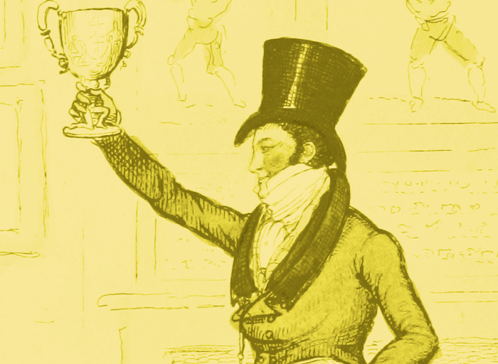

<figure><figcaption>
    Programming Historian is DH 2016 Award Winner - Best Series of Posts.</figcaption></figure>

Congratulations to our 2016 authors for winning the [2016 Digital Humanities Award for best series of posts](http://dhawards.org/dhawards2016/results/).

A full recap of their contributions can be found on our [2016 Roundup](http://programminghistorian.org/posts/twenty-sixteen-review).

Contributions this year include:

- Amanda Visconti, '[Building a static website with Jekyll and GitHub Pages](http://programminghistorian.org/lessons/building-static-sites-with-jekyll-github-pages)', *Programming Historian* (18 April 2016).
- Matthew Lincoln, '[Reshaping JSON with jq](http://programminghistorian.org/lessons/json-and-jq)', *Programming Historian* (24 May 2016).
- Shawn Graham, '[The Sound of Data (a gentle introduction to sonification for historians)](http://programminghistorian.org/lessons/sonification)', *Programming Historian* (7 June 2016).
- Daniel van Strien, '[An Introduction to Version Control Using GitHub Desktop](http://programminghistorian.org/lessons/getting-started-with-github-desktop)', *Programming Historian* (17 June 2016).
- M.H. Beals, '[Transforming Data for Reuse and Re-publication with XML and XSL](http://programminghistorian.org/lessons/transforming-xml-with-xsl)', *Programming Historian* (7 July 2016).
- Ted Dawson, '[Introduction to the Windows Command Line with Powershell](http://programminghistorian.org/lessons/intro-to-powershell)', *Programming Historian* (21 July 2016).
- Jacob W. Green, '[Introduction to Mobile Augmented Reality Development in Unity](http://programminghistorian.org/lessons/intro-to-augmented-reality-with-unity)', *Programming Historian* (24 July 2016).
- Jonathan Reeve, '[Installing Omeka](http://programminghistorian.org/lessons/installing-omeka)', *Programming Historian* (24 July 2016).
- Brandon Walsh, '[Editing Audio with Audacity](http://programminghistorian.org/lessons/editing-audio-with-audacity)', *Programming Historian* (5 August 2016).
- Taryn Dewar, '[R Basics with Tabular Data](http://programminghistorian.org/lessons/r-basics-with-tabular-data)', *Programming Historian* (5 September 2016).
- Peter Organisciak and Boris Capitanu, '[Text Mining in Python through the HTRC Feature Reader](http://programminghistorian.org/lessons/text-mining-with-extracted-features)', *Programming Historian* (22 November 2016).

A great group like that is tough to beat. Thanks to everyone who voted to support the project.
