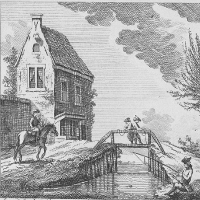
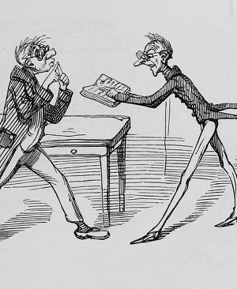
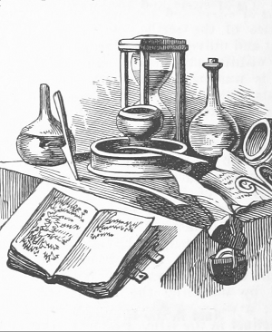

# Contribuye a The Programming Historian en español

_The Programming Historian en español_ es posible gracias al esfuerzo de voluntarios, y por eso aceptamos cualquier tipo de contribución por parte de la comunidad hispánica. Te animamos a formar parte del proyecto traduciendo, escribiendo o revisando una lección, entre otras posiblidades. ¡Queremos escuchar tus ideas sobre cómo ampliar las vías de participación!

## Traduce una lección
<figure>
	
</figure>

Si tienes dominio del inglés y del español, puedes traducir una lección ya publicada en _The programming Historian_. De esta manera participarás en la comunidad hispánica de las humanidades digitales y profundizarás en un lenguaje, método o tecnología. 

Buscamos traducciones rigurosas y de lectura amena que tengan en cuenta el contexto hispánico y los recursos disponibles en nuestra comunidad. 

## Escribe una lección

<figure>
	
</figure>

También aceptamos envíos de [nuevas lecciones] por parte de los autores.

Escribir un tutorial es una de las mejores maneras de profundizar en un método o habilidad y participar de manera activa en la comunidad de humanidades digitales.

Nuestro objetivo no es aceptar o rechazar artículos como una revista académica tradicional. Por el contrario, nuestro equipo editorial colaborará y te ayudará a mejorar la escritura de la lección y cómo plantearla de manera adecuada para que resulte clara y útil. Nuestro proceso de revisión contribuye a mejorar las lecciones y tu destreza a la hora de escribir sobre temas técnicos o especializados. Por favor, no dudes en leer más sobre el proceso de [envío].

Si quieres proponer una lección (escrita por ti o por otra persona), envía un email a [Antonio Rojas]. 

## Únete a nuestro equipo de revisores

<figure>
	
</figure>

La revisión por pares es esencial para producir recursos fiables de calidad. El equipo de _The Programming Historian en español_ tiene en gran estima el proceso de revisión y, además, adopta una aproximación abierta y colaborativa en la que los revisores reciben crédito de manera pública y completa por su trabajo. Para más información sobre nuestra filosofía y forma de trabajar, por favor, consulta la Guía para [revisores].

Te animamos a que te unas a nuestro equipo de revisores. El tiempo dedicado es flexible; de esta manera, contribuirás a mantener la calidad de los contenidos. Por favor, envía un email a [Antonio Rojas] con una breve presentación y dinos en qué métodos, herramientas, temas o tecnologías estás interesado o interesada para que podamos encargarte la revisión de una lección apropiada. 

## Conviértete en editor

<figure>
	
</figure>

Nuestro Consejo editorial ayuda a facilitar el proceso de revisión y trabaja con los autores de manera estrecha para mejorar las lecciones. Nuestra [Guía para editores] está pensada para asegurar que todos (editores, revisores, miembros de la comunidad) tengan una experiencia justa y coherente durante el proceso de revisión.

En el futuro, de manera ocasional, publicaremos anuncios buscando más editores.

## Envía tus comentarios e informa sobre errores 

<figure>
	
</figure>

Nos gustaría recibir tus [comentarios] sobre cualquier aspecto de _The Programming Historian en español_. ¡Queremos mejorar nuestro trabajo!

Agradecemos de manera especial alertas sobre lecciones que no funcionan. A medida que las URLs y los programas se actualizan, las lecciones puede acumular fallos a lo largo del tiempo. Por favor, ayúdanos a mantener en buen estado _The Programming Historian en español_ informándonos sobre los errores que encuentres al leer o llevar a la práctica los tutoriales.

## Añádenos a tu catálogo de biblioteca 

<figure>
	
</figure>

_The Programming Historian_ está registrado en [WorldCat] -gracias a [University of Purdue library] y a Amanda Visconti- y ha sido indexado por el [Directory of Open Access Journals].
Este proyecto se propone demostrar cómo deben ser las publicaciones académicas en abierto. Por favor, ayúdanos a difundir nuestro mensaje pidiendo a tu bibliotecario o bibliotecaria que añade este recurso al catálogo de tu biblioteca.

## O simplemente ponte en contacto con nosotros

Si se te ocurren más formas de participación, siempre puedes escribirnos un email a [Antonio Rojas] con comentarios, preguntas, quejas o sugerencias. Nos comprometemos a responder a todos los mensajes tan pronto como sea posible.

---

¡Gracias por ayudarnos a mejorar _The Programming Historian en español_!

[nuevas lecciones]: http://es.programminghistorian.org/flujo-de-trabajo-nuevas-lecciones
[envío]: http://es.programminghistorian.org/flujo-de-trabajo-nuevas-lecciones
[Antonio Rojas]: mailto:rojas.castro.antonio@gmail.com
[revisores]: http://es.programminghistorian.org/guia-para-revisores
[comentarios](http://es.programminghistorian.org/comentarios)
[WorldCat]: http://www.worldcat.org/title/programming-historian/oclc/951537099
[University of Purdue library]: http://purdue-primo-prod.hosted.exlibrisgroup.com/primo_library/libweb/action/dlDisplay.do?vid=PURDUE&search_scope=everything&docId=PURDUE_ALMA51671812890001081&fn=permalink
[Directory of Open Access Journals]: https://doaj.org/toc/2397-2068
[Antonio Rojas]: mailto:rojas.castro.antonio@gmail.com
