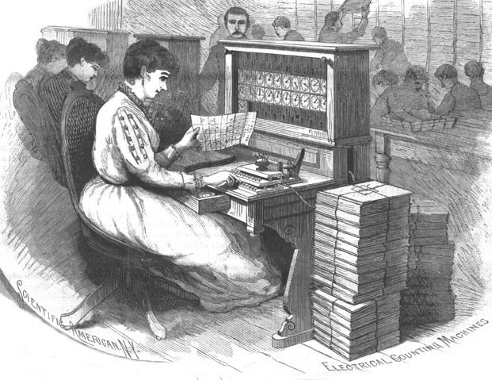

---  
layout: directory
title:  
    Acerca de Programming Historian en español
redirect_from:  /about.html
---

<figure>
	
</figure>

*The Programming Historian* ofrece tutoriales para principiantes y revisados por pares, que ayudan a humanistas en el aprendizaje de una amplia gama de herramientas digitales, técnicas y flujos de trabajo para facilitar su investigación.

Periódicamente publicamos nuevas [lecciones] y siempre damos la bienvenida a  propuestas de nuevos tutoriales sobre cualquier tema. Nuestros mentores editoriales estarán encantados de trabajar contigo durante todo el proceso de escritura de la lección. Si deseas ser un revisor o si tienes alguna sugerencia para hacer de Programming Historian en español un recurso más útil, por favor consulta nuestra página [contribuciones].

Nuestro [equipo de proyecto] y los revisores trabajan en colaboración con los autores para elaborar tutoriales que ilustren los principios fundamentales de programación y técnicas digitales. Tenemos lecciones sobre interfaces de programación de aplicaciones (APIs), de gestión de datos, de manipulación de datos, lectura distante, cartografía y sistemas de información geográfica (SIG), análisis de redes, construcción de exposiciones digitales, programación, recopilación automática de información en web o *web-scrapping*, y más. Nuestros tutoriales incluyen casi una docena de lecciones sobre herramientas populares en Historia Digital como MALLET, Omeka y QGis.

Si no puedes encontrar lo que estás buscando, esperamos tus [comentarios]. O, mejor aún: ¡[contribuye con una lección] ! *The Programming Historian* (ISSN 2397-2068) tiene como objetivo establecer un nuevo estándar para la apertura y la colaboración en las publicaciones académicas, y tú puedes ayudar en ello.

## Contacto

Por favor, dirige la correspondencia primeramente a [Ian Milligan], en la Universidad de Waterloo.

- - - - - 

* Índice
{ : toc}
- - - - - 

## Nuestra filosofía

*The Programming Historian* está comprometido con la apertura, el acceso y la calidad:

### Código abierto

*The Programming Historian* está comprometido con los principios de código abierto y acceso abierto. Todas las lecciones propuestas deben hacer uso de lenguajes de programación de código abierto y programas de código abierto cuando sea posible. Esta regla intenta minimizar los costos para todos y permitir el nivel de participación más grande posible. Creemos que cualquiera debe tener la posibilidad de beneficiarse de estos tutoriales, no solamente aquellos que cuenten con un alto financiamiento para investigación para adquirir programas de cómputo propietario.

### Acceso abierto "Gold"

Todas las contribuciones a *The Programming Historian* son publicadas con una licencia [Creative Commons BY]. Esto cumple con un modelo de publicación de acceso abierto "[Gold]", en conformidad con los requisitos de financiamiento [RCUK] y de publicación académica [HEFCE] en el Reino Unido, así como con la [Canadian Tri-Agency Open Access Policy]. Acceso abierto ‘Gold’ significa que la versión de los documentos está disponible de manera libre, sin tarifas de suscripción o restricciones de acceso. A los autores se les permite republicar sus tutoriales en cualquier sitio. Asimismo, cualquiera puede hacerlo siempre y cuando cite al autor original y respete sus derechos morales.

*The Programming Historian* está indexado en el Directorio de Revistas de Acceso Abierto [DOAJ].

No aplicamos cargos por procesamiento de artículos (APCs), o suscripción bibliotecaria.

###Revisiones

Todos los tutoriales que aparecen en *The Programming Historian* han sido rigurosamente revisados por pares, corregidos y editados. Cada lección es supervisada a través del proceso de revisión por uno de nuestros editores, a quien es asignado el texto. La revisión implica un riguroso intercambio con el editor para asegurar que la lección funciona tal cual se ha planeado y que todos los conceptos están explicados por completo para un lector no especializado, antes de que el tutotial sea enviado para su prueba a los revisores externos y que estos provean sus comentarios. Pretendemos regresar el material revisado a los autores de la manera más rápida, pero nuestra prioridad siempre es asegurar un producto de calidad.

Nuestro proceso de revisión entre pares en un poco diferente del que puede considerarse el proceso “tradicional”. No solicitamos a los revisores que juzguen si el tutorial es "suficientemente bueno" para ser publicado. Por el contrario, consideramos el proceso de revisión como un componente integral del esfuerzo de académicos colaborativo, productivo y sustentable para crear mutuamente recursos técnicos útiles. Una vez que el tutorial pasa a nuestro [flujo de trabajo editorial], nuestro objetivo es hacer todo lo posible para asegurar que el tutorial sea lo más útil posible y sea publicado en un tiempo razonable. Para más información consulta nuestra [Guía para revisores].

Una vez que ha comenzado el proceso de revisión por pares, el papel del editor es mediar entre los revisores y el autor y mantener un seguimiento a buen tiempo. A diferencia de los procesos de revisión por pares cerrados, serás avisado de los comentarios de los revisores inmediatamente en cuanto aparezcan. Esto significa que posiblemente verás los comentarios del revisor antes que el editor los vea. Si en algún momento no estás seguro si debes comenzar a abordar los comentarios o esperar a que el editor los juzgue, no dudes en enviar un mensaje para aclarar el punto. Entenderás que el editor puede tardar unos días en responder, pero esperamos que por las mejoras en la versión valga la pena esperar.

De acuerdo con las ideas de una enseñanza pública y de una revisión por pares abierta, generalmente fomentamos que las discusiones e intercambios se den en GitHub, como se describe en nuestro flujo de trabajo editorial. Sin embargo, también queremos que todos se sientan cómodos y reconocemos qeu en algunos casos unas palabras en privado puede ser lo más apropiado. Si sientes la necesidad de discutir un asunto relacionado con una lección o con una revisión, no dudes en enviar directamente [un correo electrónico al editor asignado], o penerse en contacto con nuestros *ombudsperson*, [Ian Milligan o Amanda Visconti].

Nos esforzamos en asegurar que todos los tutoriales sean funcionales a partir de la fecha de su publicación. No obstante, de vez en cuando cambia la tecnología y las lecciones dejan de funcionar según lo previsto. Si esto sucede, por favor [háznoslo saber] y asignaremos un editor para solucionar el problema.

## Financiamiento y propiedad

*The Programming Historian* es una iniciativa dirigida por voluntarios, controlada en su totalidad por el "Consejo Editorial de The Programming Historian" con la ayuda de contribuyentes de la comunidad. No es una persona jurídica y no recibe financiación directa de ninguna fuente actualmente.

El proyecto agradece el apoyo anterior recibido de la Network in Canadian History &amp; Environment ([NiCHE]), y por el apoyo en el alojamiento del Roy Rosenzweig Centre for New Media ([RRCHNM]). Si desea proporcionar apoyo financiero para ayudar al crecimiento de proyecto, póngase en contacto con uno de los miembros del [Consejo Editorial].

## Sugerencia de citación

Si deseas citar el proyecto *The Programming Historian*, te sugerimos hacerlo de la siguiente forma:

Crymble, Adam, Fred Gibbs, Allison Hegel, Caleb McDaniel, Ian Milligan, Evan Taparata, Amanda Visconti, and Jeri Wieringa, eds. *The Programming Historian*. 2nd ed., 2016. [http://programminghistorian.org].

La forma de citación de cada tutorial individual se muestra al pie de cada leccion.

[lecciones]: http://es.programminghistorian.org/lecciones
[contribuciones]: http://es.programminghistorian.org/contribuciones
[equipo de proyecto]: http://es.programminghistorian.org/equipo-de-proyecto
[comentarios]: http://es.programminghistorian.org/comentarios
[contribuye con una lección]: http://es.programminghistorian.org/contribuciones
[Ian Milligan]: mailto:i2millig@uwaterloo.ca
[Creative Commons BY]: https://creativecommons.org/licenses/by/2.0/
[Gold]: https://en.wikipedia.org/wiki/Open_access
[RCUK]: http://www.rcuk.ac.uk/research/openaccess/
[HEFCE]: http://www.hefce.ac.uk/rsrch/oa/">HEFCE
[Canadian Tri-Agency Open Access Policy]: http://www.science.gc.ca/default.asp?lang=En&amp;n=F6765465-1
[DOAJ]: https://doaj.org/toc/2397-2068
[flujo de trabajo editorial]: http://es.programminghistorian.org/flujo-de-trabajo-nueva-leccion
[Guía para revisores]: http://es.programminghistorian.org/guia-para-revisores
[un correo electrónico al editor asignado]: http://es.programminghistorian.org/equipo-de-proyecto
[Ian Milligan o Amanda Visconti]: http://programminghistorian.org/project-team
[háznoslo saber]: http://es.programminghistorian.org/comentarios
[NiCHE]: http://niche-canada.org/
[RRCHNM]: http://chnm.gmu.edu/
[Consejo Editorial]: http://programminghistorian.org/project-team
[http://programminghistorian.org]: http://programminghistorian.org/
