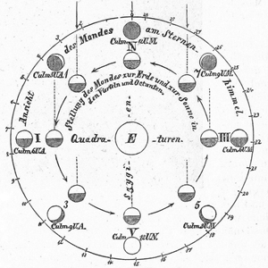

We invite you to browse around. If you can’t find a skill, technology, or
tool covered here, please let us know!

Application Programming Interfaces (APIs)
-----------------------------------------

APIs let you programmatically request specific information from a website. Learn how to use them.

<ul class="lesson-images">
  <li>
    <a href="../lessons/intro-to-the-zotero-api">
      
      <h3>Intro to the Zotero API</h3>
      
Amanda Morton

    </a>
  </li>
  <li>
    <a href="../lessons/creating-new-items-in-zotero">
      
      <h3>Creating New Items in Zotero</h3>
      
Amanda Morton

    </a>
  </li>
  <li>
    <a href="../lessons/counting-frequencies-from-zotero-items">
      
      <h3>Counting Frequencies from Zotero Items</h3>
      
Spencer Roberts

    </a>
  </li>
</ul>

Data Management
---------------

You put a lot of effort into your research. Make sure that effort lasts by adopting sustainable strategies to your code, your data, and your research processes. A little bit of planning can save you a lot of time.

<ul class="lesson-images">
  <li>
    <a href="../lessons/preserving-your-research-data">
      
      <h3>Preserving Research Data</h3>
      
James Baker

    </a>
  </li>
  <li>
    <a href="../lessons/getting-started-with-markdown">
      
      <h3>Getting Started with Markdown</h3>
      
Sarah Simpkin

    </a>
  </li>
  <li>
    <a href="../lessons/sustainable-authorship-in-plain-text-using-pandoc-and-markdown">
      
      <h3>Sustainable Authorship in Plain Text using Pandoc and Markdown</h3>
      
Dennis Tenen and Grant Wythoff

    </a>
  </li>
    <li>
    <a href="../lessons/getting-started-with-github-desktop">
      
      <h3>Introduction to Version Control Using GitHub Desktop</h3>
      
Daniel van Strien

    </a>
  </li>
    <li>
    <a href="../lessons/building-static-sites-with-jekyll-github-pages">
      
      <h3>Building Static Websites with Markdown, Jekyll, and Github Pages</h3>
      
Amanda Visconti

    </a>
  </li>

</ul>

Data Manipulation
-----------------

Just like it sounds, learn how to use programming to change, move, clean, or count data. These are essential techniques for preparing data to be used with various tools.

<ul class="lesson-images">
    <li>
    <a href="../lessons/r-basics-with-tabular-data">
      
      <h3>R Basics with Tabular Data</h3>
      
Taryn Dewar

    </a>
  </li>
  <li>
    <a href="../lessons/intro-to-bash">
      
      <h3>Introduction to the Bash Command Line</h3>
      
Ian Milligan and James Baker

    </a>
  </li>
  <li>
    <a href="../lessons/intro-to-powershell">
      
      <h3>Introduction to PowerShell</h3>
      
Ted Dawson

    </a>
  </li>
  <li>
    <a href="../lessons/research-data-with-unix">
      
      <h3>Counting and mining research data with Unix</h3>
      
James Baker and Ian Milligan

    </a>
  </li>
  <li>
    <a href="../lessons/cleaning-data-with-openrefine">
      
      <h3>Cleaning Data with OpenRefine</h3>
      
Seth van Hooland, Ruben Verborgh, Max De Wilde

    </a>
  </li>
  <li>
    <a href="../lessons/understanding-regular-expressions">
      
      <h3>Understanding Regular Expressions</h3>
      
Doug Knox

    </a>
  </li>
  <li>
    <a href="../lessons/cleaning-ocrd-text-with-regular-expressions">
      
      <h3>Cleaning OCR’d Text with Regular Expressions</h3>
      
Laura Turner O’Hara

    </a>
  </li>
  <li>
    <a href="../lessons/transliterating">
      
      <h3>Transliterating non-ASCII Characters with Python</h3>
      
Seth Bernstein

    </a>
  </li>
  <li>
    <a href="../lessons/generating-an-ordered-data-set-from-an-OCR-text-file">
      
      <h3>Generating an Ordered Data Set from an OCR Text File</h3>
      
Jon Crump

    </a>
  </li>
  <li>
    <a href="../lessons/extracting-keywords">
      
      <h3>Using Gazetteers to Extract Keywords from Sets of Free-Flowing Texts</h3>
      
Adam Crymble

    </a>
  </li>
  <li>
    <a href="../lessons/transforming-xml-with-xsl">
      
      <h3>Transforming Data for Reuse and Re-publication with XML and XSL</h3>
      
M.H. Beals

    </a>
  </li>
  <li>
    <a href="../lessons/json-and-jq">
      
      <h3>Reshaping JSON with jq</h3>
      
Matthew Lincoln

    </a>
  </li>
  <li>
    <a href="../lessons/editing-audio-with-audacity">
      
      <h3>Editing Audio with Audacity</h3>
      
Brandon Walsh

    </a>
  </li>
</ul>

Distant Reading
---------------

Computational tools allow you to make sense of a lot of documents at once. The Naive Bayesian is a machine learner. Given some examples of the kind of thing you are interested in, it can quickly find many more. A topic modeling tool takes a single text (or corpus) and looks for patterns in the use of words; it is an attempt to inject semantic meaning into vocabulary. It can help you to very quickly find ‘topics’ in a large corpus of texts.

<ul class="lesson-images">
  <li>
    <a href="../lessons/corpus-analysis-with-antconc">
      
      <h3>Corpus Analysis with Antconc</h3>
      
Heather Froehlich

    </a>
  </li>
  <li>
    <a href="../lessons/naive-bayesian">
      
      <h3>Supervised Classification with a Naive Bayesian</h3>
      
Vilja Hulden

    </a>
  </li>
  <li>
    <a href="../lessons/topic-modeling-and-mallet">
      
      <h3>Getting Started with Topic Modeling and MALLET</h3>
      
Shawn Graham, Scott Weingart, & Ian Milligan

    </a>
  </li>
  <li>
    <a href="../lessons/sonification">
      
      <h3>The Sound of Data (a gentle introduction to sonification for historians)</h3>
      
Shawn Graham

    </a>
  </li>
</ul>

Getting Ready to Program
-------------------------
If you’re new to programming in python, you’ll first need to set up a programming environment. For the most flexibility, we recommend that you follow these instructions on [setting up python on the command line](http://cli.learncodethehardway.org/book/ex1.html).

Many of the tutorials require that you install one or more python modules to save you time coding. If this is a new concept for you, read about how to install Python modules in the lesson below.

<ul class="lesson-images">
  <li>
    <a href="../lessons/installing-python-modules-pip">
      
      <h3>Installing Python Modules with pip</h3>
      
Fred Gibbs

    </a>
  </li>
</ul>

Linked Open Data
---------------
Many research datasets are published as Linked Open Data, a format that allows flexible querying and interlinking of complex sources. Get an introduction to manipulating these databases by working with some real-world examples.

<ul class="lesson-images">
  <li>
    <a href="../lessons/graph-databases-and-SPARQL">
      
      <h3>Using SPARQL to access Linked Open Data</h3>
      
Matthew Lincoln

    </a>
  </li>
</ul>

Mapping and GIS
---------------

Mapping can be an effective way to visualize and interpret historical data. These lessons introduce historical geographic information systems (GIS) using open source software.

<ul class="lesson-images">
  <li>
    <a href="../lessons/googlemaps-googleearth">
      
      <h3>Intro to Google Maps and Google Earth</h3>
      
Jim Clifford, Josh MacFadyen, Daniel Macfarlane

    </a>
  </li>
  <li>
    <a href="../lessons/qgis-layers">
      
      <h3>Installing QGIS 2.0 and Adding Layers</h3>
      
Jim Clifford, Josh MacFadyen, Daniel Macfarlane

    </a>
  </li>
  <li>
    <a href="../lessons/vector-layers-qgis">
      
      <h3>Creating New Vector Layers in QGIS 2.0</h3>
      
Jim Clifford, Josh MacFadyen, Daniel Macfarlane

    </a>
  </li>
  <li>
    <a href="../lessons/georeferencing-qgis">
      
      <h3>Georeferencing in QGIS 2.0</h3>
      
Jim Clifford, Josh MacFadyen, Daniel Macfarlane

    </a>
  </li>
</ul>

Network Analysis
---------------

Network visualizations can help humanities scholars reveal hidden and complex patterns and structures in textual sources.

<ul class="lesson-images">
  <li>
    <a href="../lessons/creating-network-diagrams-from-historical-sources">
      
      <h3>Creating Network Diagrams from Historical Sources</h3>
      
Marten Düring

    </a>
  </li>
</ul>

Digital Exhibits and Augmented Reality
----------------------

Learn how to present historical materials online.

<ul class="lesson-images">
  <li>
    <a href="../lessons/up-and-running-with-omeka">
      
      <h3>Up and Running with Omeka.net</h3>
      
Miriam Posner

    </a>
  </li>
  <li>
    <a href="../lessons/creating-an-omeka-exhibit">
      
      <h3>Creating an Omeka.net Exhibit</h3>
      
Miriam Posner and Megan R. Brett

    </a>
  </li>
  <li>
    <a href="../lessons/installing-omeka">
      
      <h3>Installing Omeka</h3>
      
Jonathan Reeve

    </a>
  </li>
  <li>
    <a href="../lessons/intro-to-augmented-reality-with-unity">
      
      <h3>Introduction to Mobile Augmented Reality with Unity</h3>
      
Jacob W. Greene

    </a>
  </li>
</ul>

Web Scraping
------------

Learn how to use programming to download material from the Internet in a controlled, semi-automated manner.

<ul class="lesson-images">
  <li>
    <a href="../lessons/data-mining-the-internet-archive">
      
      <h3>Datamining the Internet Archive Collection</h3>
      
Caleb McDaniel

    </a>
  </li>
  <li>
    <a href="../lessons/automated-downloading-with-wget">
      
      <h3>Automated Downloading with Wget</h3>
      
Ian Milligan

    </a>
  </li>
  <li>
    <a href="../lessons/applied-archival-downloading-with-wget">
      
      <h3>Applied Archival Downloading with Wget</h3>
      
Kellen Kurschinski

    </a>
  </li>
  <li>
    <a href="../lessons/intro-to-beautiful-soup">
      
      <h3>Intro to Beautiful Soup</h3>
      
Jeri Wieringa

    </a>
  </li>
  <li>
    <a href="../lessons/downloading-multiple-records-using-query-strings">
      
      <h3>Downloading Multiple Records Using Query Strings</h3>
      
Adam Crymble

    </a>
  </li>
</ul>

Introduction to Python
----------------------

The *Programming Historian* was originally written as a series of (mostly) Python lessons that
were intended to be followed in sequence.

-   [Python Introduction and Installation](../lessons/introduction-and-installation)  William J. Turkel & Adam Crymble
-   Setting Up an Integrated Development Environment for Python for [Mac](../lessons/mac-installation), [Linux](../lessons/linux-installation), or [Windows](../lessons/windows-installation)
-   [Understanding Web Pages and HTML](../lessons/viewing-html-files)  William J. Turkel & Adam Crymble
-   [Working with Text Files in Python](../lessons/working-with-text-files)  William J. Turkel & Adam Crymble
-   [Code Reuse and Modularity in Python](../lessons/code-reuse-and-modularity) William J. Turkel & Adam Crymble
-   [Downloading Web Pages with Python](../lessons/working-with-web-pages)  William J. Turkel & Adam Crymble
-   [Manipulating Strings in Python](../lessons/manipulating-strings-in-python)  William J. Turkel & Adam Crymble
-   [From HTML to a List of Words (part 1)](../lessons/from-html-to-list-of-words-1)  William J. Turkel & Adam Crymble
-   [From HTML to a List of Words (part 2)](../lessons/from-html-to-list-of-words-2)  William J. Turkel & Adam Crymble
-   [Normalizing Textual Data with Python](../lessons/normalizing-data)  William J. Turkel & Adam Crymble
-   [Counting Word Frequency with Python](../lessons/counting-frequencies)  William J.  Turkel & Adam Crymble
-   [Creating and Viewing HTML Files with Python](../lessons/creating-and-viewing-html-files-with-python)  William J. Turkel & Adam Crymble
-   [Output Data as an HTML File with Python](../lessons/output-data-as-html-file)  William J. Turkel & Adam Crymble
-   [Keywords in Context (Using n-grams) with Python](../lessons/keywords-in-context-using-n-grams)  William J. Turkel & Adam Crymble
-   [Output Keywords in Context in an HTML File with Python](../lessons/output-keywords-in-context-in-html-file)  William J. Turkel & Adam Crymble
